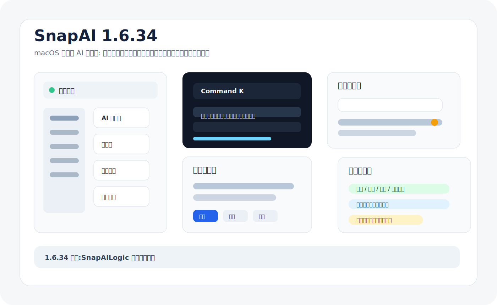
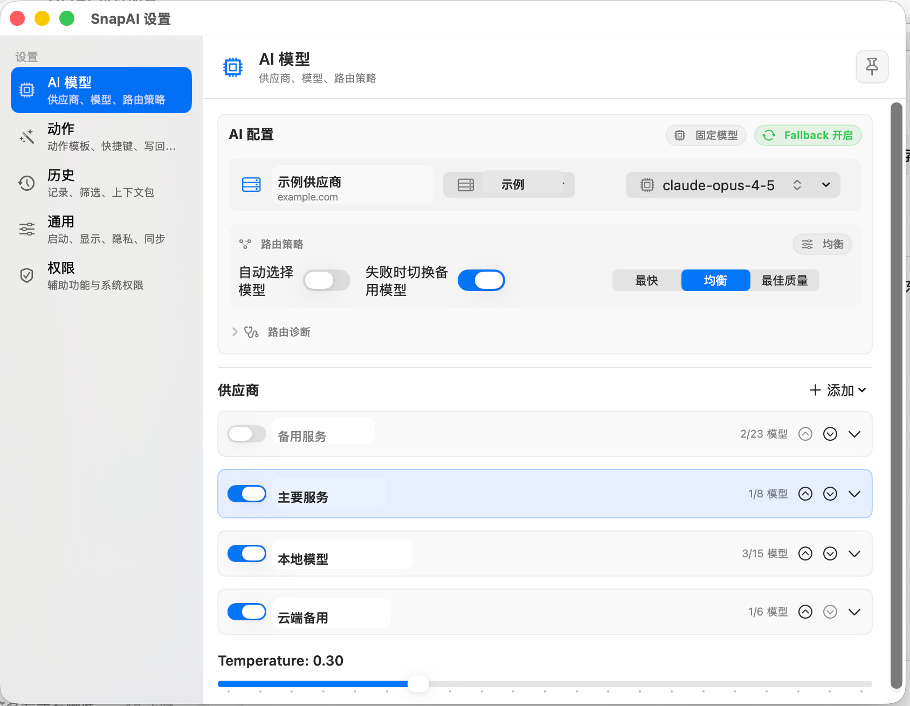

# SnapAI

SnapAI 是一个 macOS 菜单栏 AI 助手。你可以在任意应用中选中文字,用全局快捷键提问、翻译、润色、总结或解释代码;也可以直接打开快捷提问面板输入文本、粘贴图片或截图。





## 1.6.34 版本重点

- `SnapAILogic` 边界检查新增自导入防护,禁止进入 logic target 的源码 `import SnapAILogic`。
- 保留 1.6.33 的数量基线:最多 58 个 symlink、至少 18 个真实源码。
- 这能防止 app 文件加了 library import 后又被 symlink 镜像回 library target。

详细发布说明见 [SnapAI 1.6.34 Release Notes](docs/RELEASE_NOTES_1.6.34.md),阶段性复盘见 [SnapAI 1.6.34 Iteration Report](docs/ITERATION_REPORT_1.6.34.md)。剩余迁移路径见 [SnapAILogic 迁移计划](docs/LOGIC_TARGET_MIGRATION_PLAN.md)。

## 系统要求

- macOS 14 Sonoma 或更高版本
- 一个可用的 AI 服务,例如 OpenAI、DeepSeek、Claude、Ollama 或 LM Studio
- 辅助功能权限,用于读取选中文字、触发复制兜底和写回结果

## 快速安装

1. 打开 [GitHub Releases](https://github.com/junchan0412/SnapAI/releases),下载最新的 `SnapAI-vX.X.X.zip`。
2. 解压后把 `SnapAI.app` 移动到 `/Applications` 或 `~/Applications`。
3. 如果 macOS 提示“已损坏”“无法打开”或“来自未认证开发者”,执行:

```bash
xattr -cr /Applications/SnapAI.app
open /Applications/SnapAI.app
```

如果放在用户应用目录:

```bash
xattr -cr ~/Applications/SnapAI.app
open ~/Applications/SnapAI.app
```

4. 首次启动后授予辅助功能权限:

```text
系统设置 -> 隐私与安全性 -> 辅助功能 -> 勾选 SnapAI
```

5. 点击菜单栏 SnapAI 图标,打开设置页,配置 AI 供应商、API Key 和模型。

## 为什么需要 xattr -cr

SnapAI 当前没有 Apple Developer ID,也没有 Apple notarization。浏览器从 GitHub 下载后,macOS 会给应用添加 quarantine 隔离属性。未公证应用在隔离状态下可能被 Gatekeeper 拦截,表现为“应用已损坏”或“无法打开”。

`xattr -cr /Applications/SnapAI.app` 会递归清除应用 bundle 上的 quarantine 等扩展属性。它只解决 Gatekeeper 隔离问题,不会替代辅助功能权限或屏幕录制权限。

应用内自动更新会在替换后自动执行 `xattr -cr`,所以这个命令主要用于首次手动安装或手动覆盖安装。

## 默认快捷键

| 动作 | 快捷键 | 说明 |
| --- | --- | --- |
| 提问 | `Option + A` | 对选中文字提问或解释 |
| 翻译 | `Option + T` | 中英互译,只输出翻译结果 |
| 润色 | `Option + P` | 润色选中文字,默认进入替换确认 |
| 总结 | `Option + S` | 总结选中文字 |
| 解释代码 | `Option + E` | 解释选中的代码或配置 |
| 快捷提问面板 | `Option + Space` | 不依赖选区,直接输入文本或图片 |

所有动作、快捷键、Prompt、模型和供应商都可以在设置页修改。若录制混乱或发生冲突,进入:

```text
设置 -> 动作 -> 恢复默认快捷键
```

恢复默认会重置默认动作和快捷提问面板的快捷键;如果自定义动作占用了这些默认组合,SnapAI 会清除冲突的自定义动作快捷键,但不会删除自定义动作本身。

## 基本使用

1. 在任意应用中选中文字。
2. 按默认快捷键,例如 `Option + A` 提问或 `Option + P` 润色。
3. 在结果面板中复制结果、替换原文、追加到文档、导出对话或继续追问。
4. 不想先选中文字时,按 `Option + Space` 打开快捷提问面板。

润色等默认替换动作不会直接静默覆盖原文。SnapAI 会先显示差异预览,你确认后才写回目标应用。

## 跨应用取词与写回

SnapAI 的主链路是:

1. 记录触发动作前的前台应用,作为后续写回目标。
2. 优先使用 Accessibility API 读取选中文字,成功时不会污染剪贴板。
3. 如果目标应用不支持 AX 直读,回退到模拟 `Command + C`。
4. 复制兜底前会快照用户剪贴板;如果剪贴板过大或格式过多,会取消自动兜底,避免破坏剪贴板。
5. 复制兜底最多重试 3 次,并尝试解析 `.string`、`public.utf8-plain-text`、UTF-16、RTF、HTML 和部分旧式 pasteboard 文本类型。
6. 捕获成功后,SnapAI 会显示结果面板,并保留原应用作为写回目标。
7. 替换时优先恢复 AX 选区;如果文本来自剪贴板或服务菜单捕获,则信任目标应用保留的原选区并直接粘贴。
8. 写回过程中会保护用户剪贴板,写回失败时会复制结果并给出诊断建议。

1.6.8 移除了旧版“按原文字符数发送 `Shift + Left`”的重选方式。这个旧策略在长文本、多行、Emoji、输入法、网页编辑器或部分 Electron 应用中容易选错范围,导致替换变成追加。

## 权限健康中心

菜单或命令面板中打开“权限健康中心”,可以查看:

- 辅助功能权限
- 屏幕录制权限
- 开机启动状态
- 签名状态和 quarantine 状态
- 快捷键注册状态
- 最近一次文本捕获、写回和 AI 请求诊断
- 最近一次自动更新安装日志

你可以复制精简诊断或完整诊断。诊断会尽量只包含状态、错误码、应用名和恢复建议,不会包含选中的原文或 AI 输出正文。

## AI 配置示例

| 服务 | 协议 | Base URL | 模型名示例 |
| --- | --- | --- | --- |
| OpenAI | OpenAI 兼容 | `https://api.openai.com/v1` | `gpt-4o-mini` |
| DeepSeek | OpenAI 兼容 | `https://api.deepseek.com/v1` | `deepseek-chat` |
| Ollama 本地 | OpenAI 兼容 | `http://localhost:11434/v1` | `llama3.1` |
| LM Studio 本地 | OpenAI 兼容 | `http://localhost:1234/v1` | `local-model` |
| Claude | Anthropic 原生 | `https://api.anthropic.com/v1` | `claude-sonnet-4-6` |

安全限制:

- 非本机 HTTP 端点会被拒绝,避免 API Key 通过明文网络发送。
- 本机 HTTP 仅允许 `localhost`、`127.0.0.1` 和 `::1`。
- API Key 使用本地 AES.GCM 加密存储,不会写入 UserDefaults、iCloud payload 或导出的动作库。
- Ollama 或 LM Studio 这类本地兼容服务通常也需要填写一个非空 API Key 占位符,例如 `ollama` 或 `lm-studio`。

## 隐私与历史

SnapAI 支持:

- 发送前预览将提交给 AI 的内容
- 本地脱敏规则和规则测试
- 高风险内容强制预览
- 按动作关闭历史记录
- 历史仅元信息模式
- 历史搜索、收藏、删除、标签和按动作/模型/标签筛选
- 从历史创建上下文包

隐私模式会优先使用本地模型。若本地模型失败,SnapAI 不会静默切到云端模型,需要你明确选择或确认。

## 命令面板与自动化

按 `Command + K` 打开命令面板,可搜索:

- 动作和动作模板
- 模型和供应商
- 历史记录
- 上下文包
- 路由偏好和工作模式
- 常用设置开关
- 结果面板命令
- 权限健康和诊断命令

SnapAI 也支持 `snapai://` URL Scheme。常用示例:

```text
snapai://run?action=总结&text=需要处理的文本
snapai://translate?lang=en&text=你好
snapai://quick?action=翻译&text=预填内容
snapai://settings/ai
snapai://history
snapai://palette
snapai://health
snapai://update
```

直接 URL 调用没有可信原选区时,不会自动写回未知窗口。

## 应用内更新

菜单中选择“检查更新”。发现新版本后,SnapAI 会:

1. 用 macOS `URLSession` 请求 GitHub Releases,不依赖终端、`curl` 或 `gh`。
2. 下载 release zip、`snapai-manifest-vX.X.X.json` 和 `.sig` 签名文件。
3. 用应用内置公钥验证 manifest 签名。
4. 校验 zip SHA256、bundle id、designated requirement 和证书指纹。
5. 解压新版本并校验 `SnapAI.app`。
6. 启动独立 updater helper 替换当前应用。
7. 替换后执行 `xattr -cr` 并重新打开 SnapAI。

若安装目录不可写,建议把应用移动到 `~/Applications` 后再更新。

## 签名、辅助功能和本地密钥

macOS 的辅助功能权限与应用代码签名身份有关。若每次发布都使用 ad-hoc 签名或重新生成自签名证书,系统可能把新版本视为另一个应用,从而反复要求授权。

SnapAI 的推荐发布方式是:

1. 保持 `CFBundleIdentifier` 不变。
2. 使用长期固定的自签名 Code Signing 证书。
3. 每个 release 都使用同一个证书签名。
4. 继续使用签名 manifest 校验更新包。
5. API Key 不再依赖 macOS Keychain,改由本机 Application Support 中的本地加密密钥存储保护。

本仓库提供本机自签名证书脚本:

```bash
./scripts/create-local-signing-identity.sh
```

正式构建不会回退到 ad-hoc:

```bash
SNAPAI_RELEASE=1 ./build.sh --release
```

注意:自签名不是 Apple Developer ID,也不是 notarization。首次从旧 ad-hoc 版本切换到稳定自签名版本时,用户仍可能需要重新授予辅助功能权限一次;之后只要证书和 bundle id 稳定,重复授权会明显减少。

### 本地加密密钥存储

SnapAI 不再把 API Key 写入 macOS Keychain,以避免非 Apple Developer ID 分发场景中每次更新后反复弹出钥匙串访问确认。新的密钥存储行为:

- master key 保存在 `~/Library/Application Support/SnapAI/Secrets/snapai-secrets.key`。
- provider API Key 以 AES.GCM 加密后保存在同目录的 `provider-secrets.json`。
- `Secrets` 目录权限会收紧到 `0700`,key 文件和密文文件权限会收紧到 `0600`。
- 配置导出、动作库导出、iCloud 同步和诊断文本都不会包含 API Key 明文。

这个方案主要解决“更新后反复授权钥匙串”的体验问题,并避免明文落盘。它不等同于 Keychain 的系统级隔离:如果同一 macOS 用户下的恶意进程可以读取你的 Application Support 目录,理论上也能同时读取 master key 和密文文件。请仍然保护好本机账户和磁盘。

## 常见问题

### 提示“未检测到选中的文字”

请检查:

1. SnapAI 是否有辅助功能权限。
2. 当前应用是否真的有可复制文本选区。
3. 目标应用是否拦截了 `Command + C` 或不暴露 AX 选区。
4. 权限健康中心中的“最近文本捕获”诊断。

可以尝试从目标应用的系统服务菜单触发 SnapAI,或使用 `Option + Space` 打开快捷提问面板手动输入。

### 润色后没有替换原文

确认差异预览中选择了“替换”。如果目标应用不允许自动粘贴,SnapAI 会把结果复制到剪贴板并提示手动粘贴。1.6.8 已移除旧版方向键重选策略,减少“替换变追加”的风险。

### 快捷键没有反应

请检查:

1. 动作是否启用。
2. 快捷键是否与其他动作或系统快捷键冲突。
3. 权限健康中心是否显示快捷键注册失败。
4. 必要时使用“恢复默认快捷键”。

### 每次更新后都要重新授权辅助功能

请确认 release 是否使用同一个固定自签名证书。不要每次用 `codesign --sign -` ad-hoc 签名,也不要每次重新生成证书。旧 ad-hoc 版本升级到稳定自签名版本时,第一次重新授权是正常现象。

API Key 已改为本地加密存储,不再依赖 macOS Keychain。旧版本保存在 Keychain 中的 API Key 不会在启动时自动读取,以免继续触发钥匙串授权弹窗;升级后请在设置页重新填写一次 API Key,之后会保存到本地加密存储。

## 开发与测试

项目是 SwiftPM 结构:

```bash
swift build
scripts/run-logic-tests.sh
```

本机 macOS smoke 检查:

```bash
scripts/run-macos-smoke-tests.sh
```

这组检查会运行逻辑测试、校验 `SnapAILogic` target 边界,并临时写入后恢复系统剪贴板,同时探测辅助功能和屏幕录制权限状态。release preflight 还会在构建后运行 app bundle 启动 smoke,确认 `SnapAI.app` 可通过 LaunchServices 打开并产生新进程。它用于本机发版前验证,不建议放进无 GUI session 的默认 CI。

本地构建 `.app`:

```bash
./build.sh
```

正式打包前检查:

```bash
scripts/preflight-release.sh --require-clean
```

生成 release zip、manifest 和 SBOM:

```bash
SNAPAI_RELEASE=1 ./build.sh --release
SNAPAI_RELEASE=1 scripts/package-release.sh 1.6.34
```

正式 release 需要 `SNAPAI_MANIFEST_PRIVATE_KEY` 指向 manifest 签名私钥:

```bash
export SNAPAI_MANIFEST_PRIVATE_KEY="$HOME/.snapai/snapai-manifest-private.pem"
```

## 许可证

请以仓库中的许可证文件为准。
